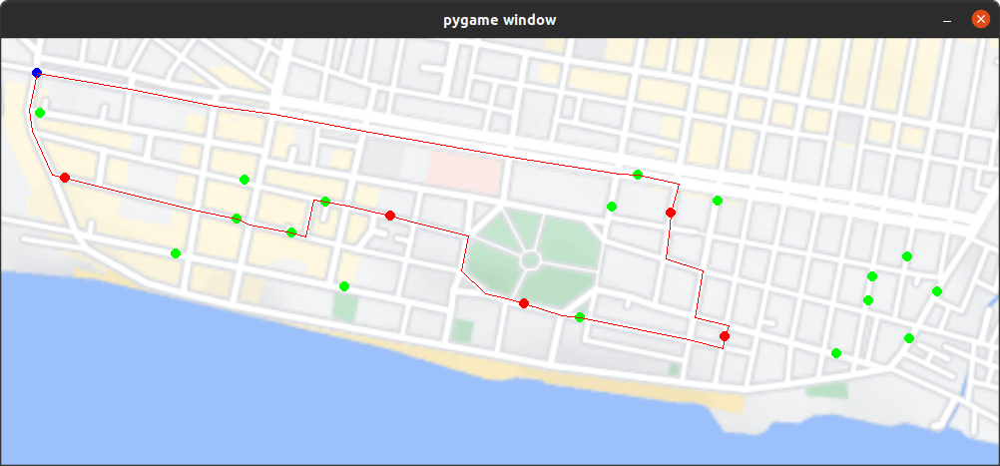
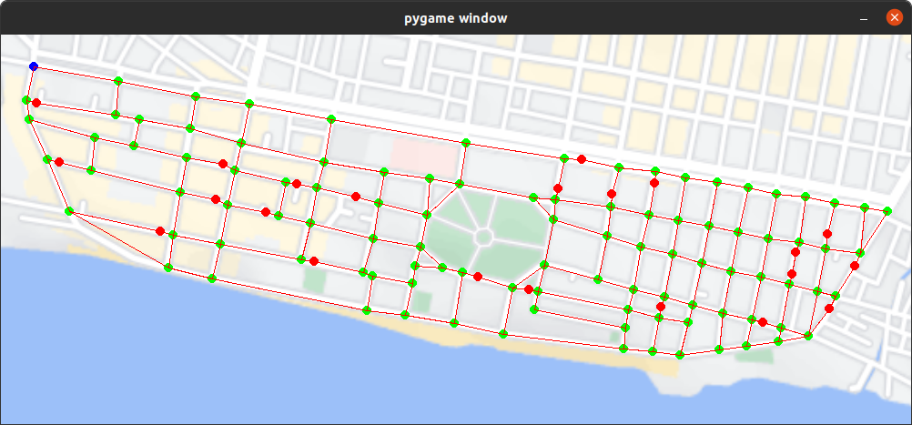

# Smart Garbage Monitoring System
A system for monitoring garbage levels in garbage bins and determining the most efficient path for the garbage collection truck.

In this project, I develop an end to end software solution for efficient garbage monitoring and collection in urban environments. The solution consists of an embedded electronics module that is IOT-enabled, a realtime cloud database, and a python app. Detailed build instructions can be found at the following link: [https://www.instructables.com/Smart-Garbage-Monitoring-System-Using-Internet-of-/](https://www.instructables.com/Smart-Garbage-Monitoring-System-Using-Internet-of-/). 

A picture of the module and an example trajectory in my hometown is attached below.




## About The Project
The idea behind the project is that, currently the garbage truck performs a circuit around the city such that it visits every gargabe bin daily. We performed a study and noticed that most of the times the bins were not full and did not require a visit from the garbage truck. This lead to the idea of creating a system to avoid this problem, by informing the garbage collection staff beforehand which are the bins that need to be emptied so that they don't have to visit every bin. In this way, time, fuel, and money is saved, since the trajectory is optmised. A further simulation showed that a 50% reduction in fuel usage is expected and the time to complete the circuit is halved.

The complete system consists of 3 major parts:
* An **arduino-based embedded device** that gets fitted to all the garbage bins in the city. This component measures the amount of garbage in the bin with the help of an ultrasonic distance sensor and uploads the data to a cloud database. Each unit has a unique identification.
* A **realtime database** is built using firebase. It keeps track of the garbage level in each of the bins.
* A **python app** that reads the database and determines all the bins that need to be emptied and then proceeds to generate the shortest path joining the bins for the garbage collection truck using Dijkstra's algorithm.

## Getting Started

### Prerequisites
* Python3
    * firebase_admin
    * pygame
* Arduino IDE
    * ESP8266WiFi drivers
    * Firebase_ESP_Client
    * NewPing

### Installation
To install the Smart Garbage Monitoring System, install the required librarires and clone this repository using the following commands:

```
pip install firebase-admin
pip install pygame
git clone https://github.com/kousheekc/Smart-Garbage-Monitoring-System.git
```

If you decide to use an ESP8266, you will need the required board drivers. Open the Arduino IDE, go to **File -> Preferences** and paste the following link **https://arduino.esp8266.com/stable/package_esp8266com_index.json** in the **Additional boards manager URLS** section. Next, go to **Tools -> Board -> Boards Manager** and search for **ESP8266** and install the drivers.

To install the arduino libraries, open the Arduino IDE, go to **Sketch -> Include Library -> Manage Libraries** and search and install the following libraries:
* Firebase Arduino Client Library for ESP8266 and ESP32
* NewPing

You will also need to create a new realtime database on firebase since I have not made mine public. Instructions can be found at the following link: [https://firebase.google.com/docs/database](https://firebase.google.com/docs/database)

## Usage
The first step is to generate the graph of the town where the nodes represent either interesections, bins or the garage and the edges represent the roads. To do this, add a new directory containing a screenshot of your town to the **data/maps** directory. Refer to the existing example.

Next navigate to the directory you cloned earlier and run the following command:
```
python3 -m utils.generate_graph --town_name NAME_OF_YOUR_TOWN_HERE
```

Here are the features of the app:
* **Left mouse button click** adds an intersection node
* **Right mouse button click** adds a bin node
* **Middle mouse button click** adds a garage node (starting point)
* **Hovering over a node and pressing x** removes the node
* **Left mouse button click on two consecutive nodes** creates an edge between them
* **Space button** saves the graph as an adjacency list

To verify the graph you can run the following command:
```
python3 -m utils.load_graph --town_name NAME_OF_YOUR_TOWN_HERE
```

Complete the initlialisation process by running the following two commands:
```
python3 -m utils.generate_bin_data --town_name NAME_OF_YOUR_TOWN_HERE
python3 -m utils.firebase_init --town_name NAME_OF_YOUR_TOWN_HERE
```

Next upload the arduino script and change the BIN_ID on line 64 to the appropriate ID and upload the script.

Finally run the following command to get the shortest path that covers all the active bins.

```
python3 -m src.shortest_path --town_name NAME_OF_YOUR_TOWN_HERE 
```

## Improvements
- [x] Realtime database
- [x] Easily add new towns through UI
- [ ] Power saving mode
- [ ] Solar power?
- [ ] 4G based 
- [ ] Google maps API integration
- [ ] Real time clock in module

## License
Distributed under the MIT License. See [LICENSE](LICENSE) for more information.

## Contact
Kousheek Chakraborty - kousheekc@gmail.com

Project Link: [https://github.com/kousheekc/Smart-Garbage-Monitoring-System](https://github.com/kousheekc/Smart-Garbage-Monitoring-System)


### Graph generation



### Trajectory generation


